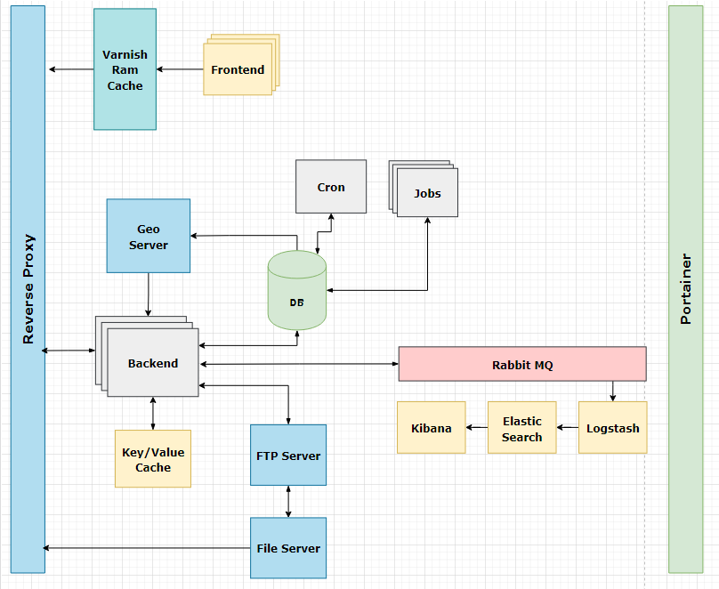
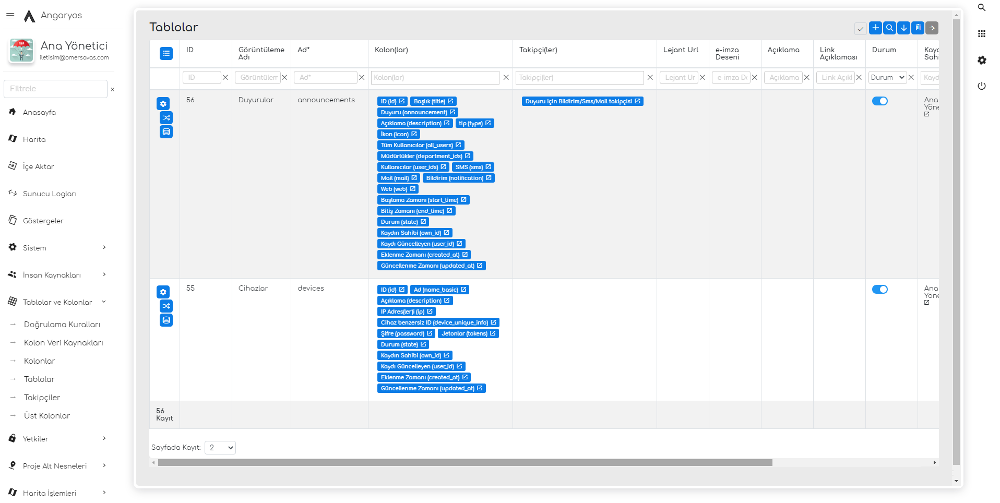
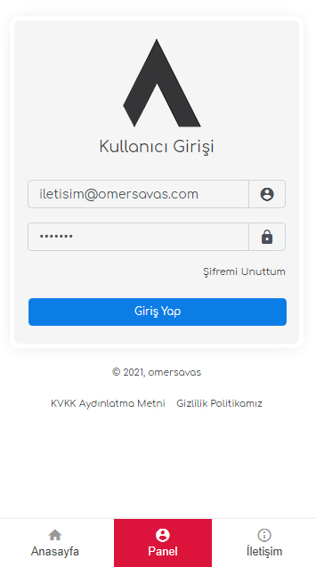
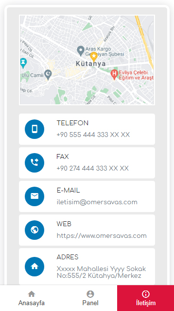
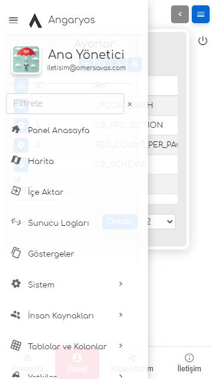

# Angaryos

Merhaba. Bu; yazılımcıları yazılımın **angarya kısmından kurtarıp** esas işe odaklanmalarını sağlayacak olan açık kaynak bir yazılım geliştirme altyapısıdır. Temel olarak **veri setlerinizi kaydedip** güvenli ve yetki kontrollü bir biçimde; **API yada arayüz** aracılığı ile **sunmanızı** ( güncellemenizi / eklemenizi / silmenizi / datanın geçmişini takip edebilmenizi / geri yükleyebilmenizi / export edebilmenizi) sağlar.



Sistem tamamen **docker-stack** üzerinde çalışmaktadır. Bu sayede daha yoğun uygulamalar için ölçekleneblir. **GIS** desteği sayesinde coğrafi veri üretebilmenizi ve saklayabilmenizi sağlar. Yoğun dosya trafiği olan uygulamalarda kullanabilmeniz için dosya sunucusu bağımsız bir servis olarak eklenmiştir. Bu sayede **ftp yada bulut** servislerinizi de dosya deposu olarak kullanabilirsiniz. Log tutmak için -varsayılan olarak kapalı olsa da- **Elastic search-Logstash-Kibana** kurulmuştur. Ayrıca asenkron ve rutin işlemler için **Jobs ve Cron** servisleri bağımsız olarak çalışmaktadır. Bunun yanında bu framework; **data entegratör, dahili bir mobil uygulama (ionic), dinamik rapor tasarlayabilme, coğrafi veri üretme aracı, IOT login, e-imzalama yapabilme...** gibi bir çok yan özellik barındırmaktadır.


| Servis Adı     | Kullanılan Yazılım | Açıklama                     |
| ----------------- | ----------------------- | -------------------------------- |
| Veritabanı     | Postgresql/Postgis    |                                |
| Backend         | Laravel               |                                |
| Jobs/Cron       | Laravel               |                                |
| Frontend        | Angular               |                                |
| Frontend Cache  | Varnish               |                                |
| Logs            | Elk stack             | Varsayılan olarak kapalıdır |
| GIS Server      | Geoserver             |                                |
| Reverse Proxy   | Traefik               |                                |
| CTX Manager     | Portainer             |                                |
| Key/Value Cache | Memcache              |                                |
| Ftp/File        | Vsftpd                |                                |
| Queue           | Rabbit                |                                |


## Gereksinimler

- Minimum 1 core cpu, 1 GB ram, 10 GB hdd
- Önerilen 2 core cpu, 2GB ram, 25 GB hdd

## Kurulum

Bu uygulama, içerisinde bir çok servisi barındırır. Bu sebeple önerilen, sanal bir işletim sistemi[1] üzerinde kurulum yapılmasıdır. Aşağıdaki kurulum komutunu çalıştırdığınızda sizden host adresi istenecektir; ardından kurulum, gerekli ayarları yapıp servisleri başlatır. Uygulamaya https://host.adresiniz/ üzerinden erişiebilirsiniz

[1] 64 bit Ubuntu Server önerilmektedir.

### Linux

```
sudo wget https://raw.githubusercontent.com/MikroGovernment/angaryos-stack/master/start.sh
sudo chmod +x start.sh
sudo ./start.sh 
cd angaryos-stack
./payload.sh
```

### Windows

```
hazırlanıyor...
```

### Mac

```
hazırlanıyor...
```

## Kullanım

Dokümanlar için [tıklayınız](https://github.com/mikroGovernment/angaryos-docs) 
Varsayılan şifreler için [tıklayınız](https://github.com/mikroGovernment/angaryos-stack/blob/master/backend/.env) 

**** Varsayılan web arayüz teması bir lisans anahtarına ihtiyaç duyar.


## Güncelleme

Güncelleme yapmadan önce framework içerisinde değiştirdiğiniz dosyaların adresini "./.updateignore" dosyasına eklemelisiniz; yoksa üzerine yazılabilir. Örnek bir .updateignore dosyasına "./.updateignore-example" yolundan ulaşabilirsiniz. Ardından ana dizinde "python3 update.py" komutu ile güncellemeyi başlatabilirsiniz. Güncelleyici her ihtimale karşı bazı önemli dizinlerinizi "./../AngaryosBackup..." dizinine yedekleyecektir.

Güncelleme tamamlanınca "https://host.adresiniz/api/v1/upgradeDb" adresine bir istek atarak -varsa- veritabanı tarafında yapılması gereken upgrade işlemlerini başlatabilirsiniz. Bu adresi çağırmadan önce veritabanında neler değişeceği hakkındaki güncelleme notlarını okumanızı tavsiye ederiz.


## Önizlemeler










